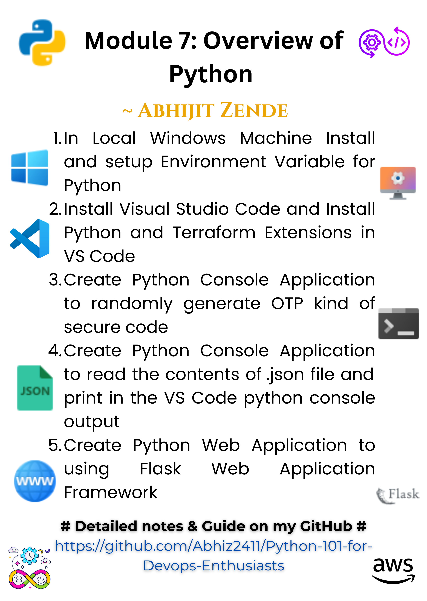

# 🤖 Module 7: Python 101 for DevOps Enthusiasts 🔧

---



---

### 📊 Repository Overview:

- **Purpose**: Explore the basics of Python, build essential scripts, and leverage Flask for web app creation.  
- **Tasks Covered**: 
  - 🌐 Setting up Python and VS Code environment
  - 🔐 Building a secure OTP generator
  - 🔎 Reading and parsing JSON files
  - 🔧 Developing Flask-based web applications
- **Extras**: Python notes for beginners 🤖 and reusable automation scripts 🎯.

---

### 🛠️ What's Inside:

- **Assignments**:
  - **L1**: Install Python and configure environment variables 🚀.
  - **L2**: Install VS Code and set up Python/Terraform extensions 🔧.
  - **L3**: Create a console app to generate secure OTP codes 🔐.
  - **L4**: Parse and print JSON file content in the console 🔖.
  - **L5**: Build a Flask web app 🛠️.

- **Resources**: 
  - Python notes 🖋️.
  - Common automation scripts 🔧.

- **Extras**:
  - Study resources for Python beginners 📖.

---

### 🚫 Prerequisites:

- Python 3.x installed
- Visual Studio Code installed with extensions
- Basic understanding of programming fundamentals 🤔

---


### 📚 Notes for Beginners:

- Change directory to Notes directory for detailed notes
  ```bash
  cd Notes
  ```
- **Getting Started**: Python installation, environment variables, and using VS Code.
- **Core Concepts**: Loops, conditions, and functions explained concisely.
- **Scripts & Flask**: Real-world use cases and examples.

---

### 🌐 Connect with Me:

- **Portfolio**: [Abhijit Zende](https://abhijit-zende.vercel.app/)
- **Hashnode**: [Curious Abhi](https://abhijitzende.hashnode.dev/)

---

### 📢 Shoutout:

Feel free to star ⭐ this repository and fork ⚖️ it for your own experiments!

